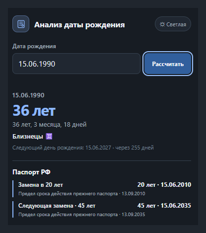
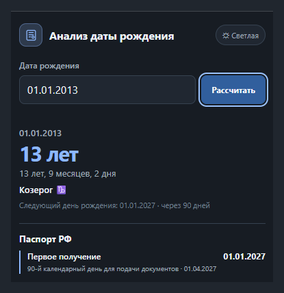
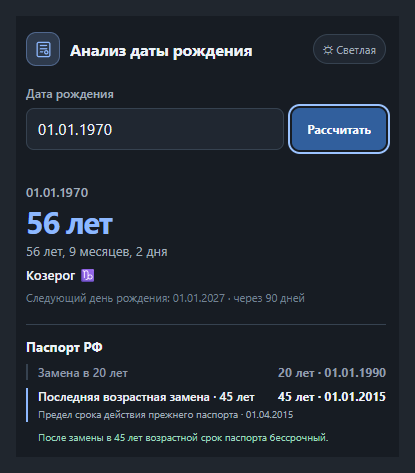
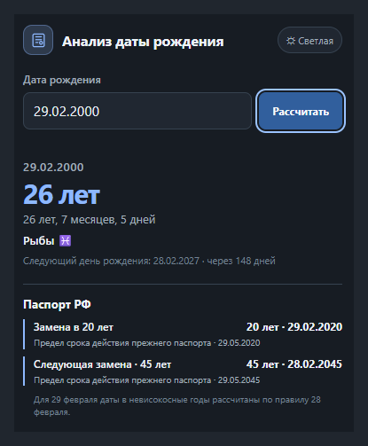
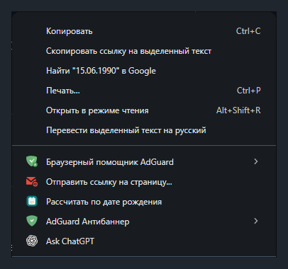

# Анализ даты рождения

Локальное Chrome-расширение рассчитывает возраст, знак зодиака и контрольные даты замены паспорта по дате рождения.



## Скачать

**[Последняя версия](https://github.com/svsharav-afk/birth-date-analysis/releases/latest)** — ZIP для загрузки в Chrome.

## Возможности

- Возраст в полных годах и подробный календарный возраст.
- Знак зодиака.
- Контрольные даты первого получения паспорта в 14 лет и возрастных замен в 20 и 45 лет.
- 90-дневные календарные границы и следующий возрастной этап.
- Ручной ввод даты с автоматическим форматированием: `15061990` → `15.06.1990`.
- Быстрый расчёт по дате, выделенной на странице.
- Тёмная и светлая темы.

## Как выглядит

<table>
  <tr>
    <td align="center" valign="top">
      <br />
      <sub>01.01.2013 — до первого получения паспорта</sub>
    </td>
    <td align="center" valign="top">
      <br />
      <sub>01.01.1970 — возраст 45+</sub>
    </td>
  </tr>
  <tr>
    <td align="center" valign="top">
      <br />
      <sub>29.02.2000 — високосная дата</sub>
    </td>
    <td></td>
  </tr>
</table>

## Установка в Chrome

1. Скачайте ZIP по ссылке **[Последняя версия](https://github.com/svsharav-afk/birth-date-analysis/releases/latest)**.
2. Распакуйте архив в постоянную папку, например `Документы\Chrome Extensions\Анализ даты рождения`.
3. В Chrome откройте `chrome://extensions`.
4. Включите переключатель **Режим разработчика**.
5. Нажмите **Загрузить распакованное расширение**.
6. Выберите папку, в которой сразу виден файл `manifest.json`.
7. При желании закрепите расширение на панели Chrome через меню значка расширений.

**Не удаляйте распакованную папку после установки — Chrome использует файлы расширения прямо из неё.**

## Как пользоваться

### Ручной ввод

Введите `15061990`. Поле покажет `15.06.1990`; нажмите **Рассчитать**.

### Быстрый расчёт на странице

1. Выделите дату рождения.
2. Нажмите правой кнопкой мыши.
3. Выберите **Рассчитать по дате рождения**.
4. Popup откроется с результатом.



## Паспортные контрольные даты

Блок показывает дату первого получения паспорта в 14 лет, возрастные замены в 20 и 45 лет, соответствующие календарные границы и следующий этап. Эти даты помогают сопоставить возрастные ориентиры с датой выдачи, которую пользователь сам видит в документе. Расширение не проверяет паспорт и не выносит заключений о его действительности.

Подробная методика и источники: [docs/PASSPORT_RULES.md](docs/PASSPORT_RULES.md).

## Конфиденциальность и разрешения

Расчёты выполняются в браузере; введённые даты не отправляются на сервер. Внешние API не используются.

- `contextMenus` — команда контекстного меню для выделенной даты.
- `storage` — временная передача выделенного текста popup и service worker, а также сохранение настройки темы.

Расширение не запрашивает host permissions и не получает постоянный доступ ко всем сайтам. Оно не читает содержимое страниц и не отправляет данные наружу.

## Требования

**Google Chrome 127 или новее.** Минимальная версия нужна для открытия popup непосредственно из service worker через используемый Chrome API.

## Разработка

Расширение использует Manifest V3, HTML, CSS и JavaScript без сторонних runtime-библиотек. Для тестов нужен Node.js со встроенным test runner:

```sh
node --test
```

Основные каталоги: `lib/` — вычислительные модули, `tests/` — unit tests, `icons/` — иконки и их SVG master, `docs/` — пользовательская методика.

## Ограничения

Расширение показывает календарные сведения по дате рождения. Оно не принимает дату выдачи паспорта, не определяет подделку, просрочку или мошенничество и не заменяет проверку документа по официальным каналам. Для даты рождения 29 февраля применяется расчётное соглашение проекта; подробности приведены в [методике паспортных правил](docs/PASSPORT_RULES.md).
